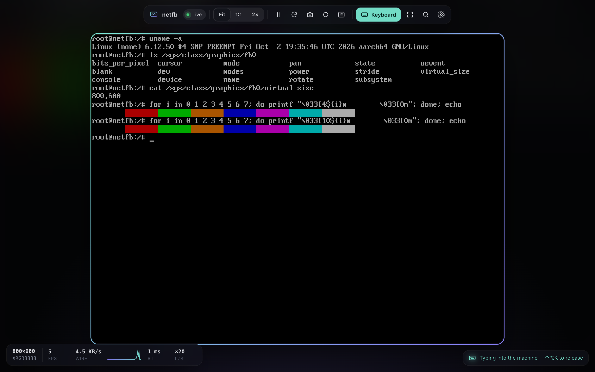
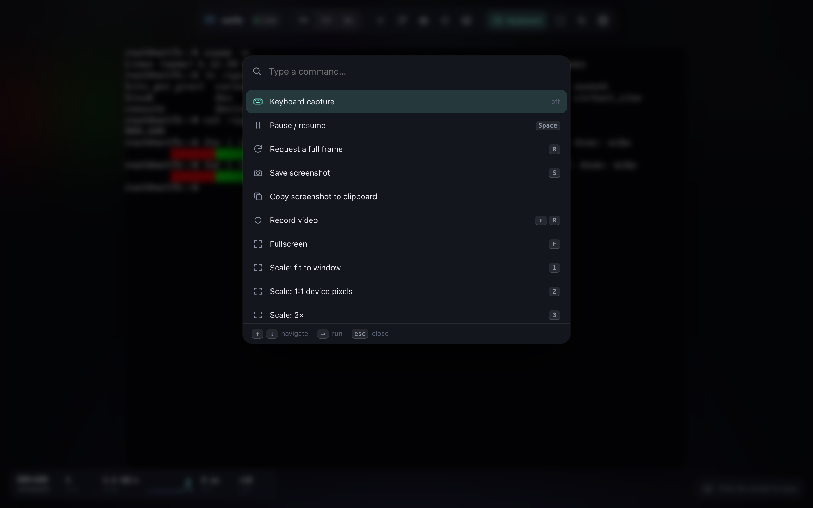
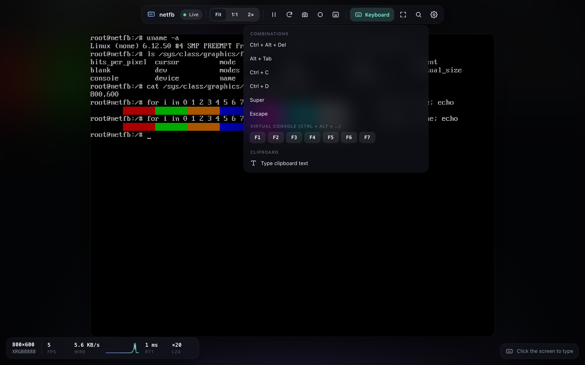
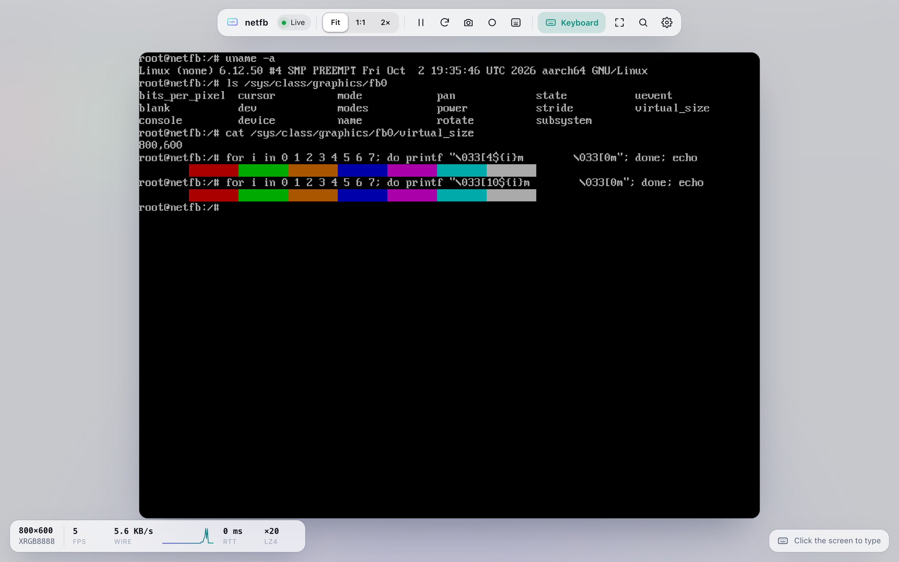
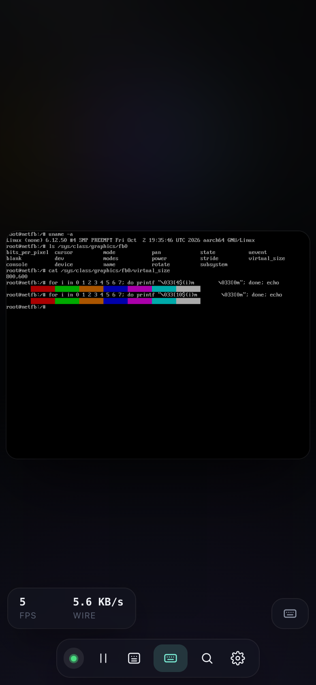

# netfb

A Linux kernel module that creates a virtual framebuffer (`/dev/fbN`) and serves it
to a web browser over HTTP and WebSocket, or to any VNC client, with keyboard input
going back. The framebuffer console, or anything else that draws through the fbdev
interface, shows up live in a browser tab or a VNC viewer, with no X server or
user-space daemon.

## What it is for

- **Console of a headless box or VM.** The kernel's framebuffer console (fbcon) in a
  browser tab, with a working keyboard, colours and virtual console switching
  (Ctrl+Alt+F1..F7). It runs as soon as the module is loaded, so it works in an
  initramfs, on a board without a display, or in a VM that has no graphics device.
- **Any VNC viewer.** With `vnc_port=5900` the same framebuffer is also a VNC server
  (RFB 3.3/3.7/3.8, Raw and ZRLE), for the viewers you already have: macOS Screen
  Sharing, TigerVNC, RealVNC, Remmina, noVNC behind a WebSocket proxy.
- **Applications that draw to the framebuffer.** Anything that writes to `/dev/fbN`
  with `write()` or `mmap()` can be pointed at the netfb device and watched remotely.
  Tested here: fbcon, `write()` and `mmap()` drawing. Not tested, but they use the same
  interface: fbdev back ends of SDL and LVGL, Xorg's `fbdev` driver, `fbi`.
- **Screenshots and video of an embedded UI.** The page can save or copy a PNG and
  record WebM. The wire format is documented below, so a script can fetch frames
  directly; `test/browser.py` drives the page from headless Chrome.
- **Framebuffer driver and kernel work without hardware.** A framebuffer with deferred
  I/O, damage tracking and an input device, small enough to read in an evening
  (about 1700 lines of C). It was developed against QEMU.

What it is not:

- It is a separate virtual framebuffer. It does not mirror an existing physical
  `/dev/fb0`; point the application, or fbcon (`con2fbmap`), at the netfb device.
- It is not a replacement for VNC or RDP. There is no mouse input, no clipboard from
  the machine to the browser, no audio, and no TLS (see the security model).

## Quick start

Build against the target kernel's headers and load it:

    make KDIR=/path/to/kernel/build
    sudo insmod netfb.ko width=1024 height=768 keyboard=1 \
         bind_addr=0.0.0.0 token=$(openssl rand -hex 16)

then open `http://<host>:8080/?token=<token>`. Without `bind_addr` it listens on
127.0.0.1 only and needs no token. The kernel log says which `/dev/fbN` was created:

    netfb: fb0: 1024x768@32, serving on http://0.0.0.0:8080/ (token required) keyboard input ENABLED

## Screenshots

| | |
|---|---|
|  |  |
| Command palette (Cmd/Ctrl+K) | Send keys: Ctrl+Alt+Del, Alt+Tab, console switching |
|  |  |
| Light theme (follows the system) | Phone layout |

## Features

- Drawing by `write()`, `mmap()` and fbcon is tracked per row (deferred I/O plus
  the fbdev damage hooks); each client is sent only the rows that changed.
- VNC server (opt-in) with Raw and ZRLE encodings and any true-colour client pixel
  format; key events go through the same virtual keyboard as the web UI.
- Pixel messages are LZ4-compressed in the kernel (raw when that is smaller).
  A mostly-black console frame is 1.92 MB raw and about 32 KB on the wire.
- A slow client sees a lower frame rate; nothing is queued per client.
- Key press to changed pixels is 1-2 ms on a local link (measured through QEMU's
  user-mode network).
- Optional keyboard input through a virtual input device (`keyboard=1`).
- The web UI is one gzipped HTML file embedded in the module: no files to install.

## Build

Needs the headers of the target kernel and `gzip`.

    make KDIR=/path/to/kernel/build      # default: /lib/modules/$(uname -r)/build

Kernel configuration required: `CONFIG_FB`, `CONFIG_FB_DEFERRED_IO`,
`CONFIG_FB_SYSMEM_HELPERS_DEFERRED`, `CONFIG_FB_SYS_FILLRECT/COPYAREA/IMAGEBLIT/FOPS`,
`CONFIG_CRYPTO_SHA1`, `CONFIG_LZ4_COMPRESS` (via `CONFIG_CRYPTO_LZ4`), `CONFIG_INPUT`,
and for VNC `CONFIG_CRYPTO_LIB_DES` (via `CONFIG_CRYPTO_DES`) and `CONFIG_ZLIB_DEFLATE`
(via `CONFIG_CRYPTO_DEFLATE`).
`CONFIG_FRAMEBUFFER_CONSOLE` if you want a console on it.

Builds warning-free against Linux 6.12, 6.17 and 6.19 (arm64). The end-to-end test
ran on 6.12 only.

## Parameters

| parameter       | default     | meaning                                                         |
|-----------------|-------------|-----------------------------------------------------------------|
| `width,height`  | 800x600     | mode, 16..8192; row at most 32 KiB, total at most 64 MiB        |
| `bpp`           | 32          | 16 (RGB565) or 32 (XRGB8888)                                    |
| `bind_addr`     | 127.0.0.1   | IPv4 address to listen on                                       |
| `port`          | 8080        | TCP port                                                        |
| `token`         | none        | access token, 16-128 chars of `[A-Za-z0-9._~-]`                 |
| `vnc_port`      | 0 (off)     | TCP port of the VNC server; 5900 is the usual one               |
| `vnc_password`  | none        | VNC password, exactly 8 printable ASCII characters              |
| `vnc_lockout`   | 60          | seconds a source is locked out after 5 failed VNC logins, 0 = off |
| `allow_insecure`| 0           | allow a non-loopback `bind_addr` without a token or VNC password |
| `keyboard`      | 0           | create an input device and accept key events from the UI        |
| `max_clients`   | 8           | concurrent connections, 1..64 (each open tab is one)            |
| `max_fps`       | 30          | per-client update rate cap, 1..120                              |

With a token, open `http://host:8080/?token=...` (the UI removes it from the URL),
or enter it in the prompt the UI shows.

## Web UI

One self-contained page (no external requests). Floating dock, live statistics
(rate with sparkline, round-trip time, compression ratio), an ambient glow sampled
from the screen, a command palette (Cmd/Ctrl+K or `/`), screenshot (save or copy),
video recording, fullscreen, and a menu for Ctrl+Alt+Del, Alt+Tab and virtual
console switching. Light and dark themes follow the system; the layout works on
phones.

Keyboard (needs `keyboard=1`): click the screen or press `K`. A rotating ring marks
capture; Ctrl+Alt+K (Control+Option+K on a Mac) releases it. Keys are sent as Linux
key codes to a US-keymap guest, so typing is handled for other layouts and for macOS:

- **Characters** mode (default) types what is printed on your keycaps: a German
  keyboard's Z key types `z`, Option+L (`@`) types `@` without Alt, Shift+7 (`/`)
  types `/` without Shift. **Physical keys** mode sends key positions instead.
- macOS delivers no key-up for keys pressed while Cmd is held, so they are released
  automatically; Cmd can send Super (default) or Ctrl. Caps Lock is a single event
  per toggle on a Mac and is handled as one; in Characters mode case comes from the
  characters themselves.
- Cmd+V (Ctrl+Shift+V elsewhere) types the clipboard into the machine. Held keys are
  released on blur, on tab switch and when the connection drops.
- Shortcuts are matched by the character on the key, not its position, and shown
  with the platform's glyphs. On Chromium in fullscreen the Keyboard Lock API lets the
  page see Esc and Cmd combinations; otherwise the browser keeps Cmd+W, Cmd+T, Cmd+Q.
- Touch devices get the on-screen keyboard through a hidden input.

## VNC

    insmod netfb.ko vnc_port=5900 vnc_password=pAssw0rd keyboard=1

then point a viewer at `host:5900` (macOS: `open vnc://host:5900`). `HTTP` stays
available on `port`, and both count against `max_clients`.

- Protocol: RFB 3.3, 3.7 and 3.8 (a client announcing 3.889 is spoken to as 3.8);
  security type VNC Authentication, or None when there is no password and the bind
  address is loopback; encodings Raw and ZRLE; any true-colour pixel format (8, 16 or
  32 bits, either byte order). Colour-map formats are refused.
- Input: key events, through the same virtual keyboard as the web UI (`keyboard=1`);
  the keysym decides the character, so a client that sends Shift with a lower-case
  keysym still types what the keysym names. No pointer and no clipboard: those
  messages are accepted and ignored.
- Updates are only sent for areas the client has requested (RFB is pull based), and only
  for rows that changed.
- Tested against an independent client written for the test suite (versions,
  authentication, both encodings, five pixel formats, partial requests, keys, malformed
  input) and against vncdotool. Not verified against macOS Screen Sharing, TigerVNC or
  RealVNC.

**VNC authentication is weak.** It is DES with an 8 character password, because that is
the one scheme every VNC client implements. Anyone who can observe a login can try
passwords offline against the captured challenge, and nothing after the login is
encrypted. Mitigations built in: the VNC listener is off unless asked for, a non-loopback
bind needs `vnc_password`, a failed login is answered after 1.5 s, and 5 failures lock the
source address out for `vnc_lockout` seconds. For anything beyond a trusted LAN, bind to
loopback and tunnel:

    ssh -N -L 5900:127.0.0.1:5900 user@host        # then connect the viewer to localhost:5900

Stronger RFB security types (RSA-AES, VeNCrypt/TLS) are not implemented: they need a
large amount of cryptographic protocol code in the kernel, or a user-space helper.

## Security model

The server runs in the kernel and parses network input, so it is deliberately
small and strict. Read this before binding it anywhere but loopback.

- Loopback by default. A non-loopback bind is refused unless a token is set
  (or `allow_insecure=1`).
- `/ws` and `/api/info` need the token (query or `Authorization: Bearer`),
  compared in constant time. `/` is a static page and is public.
- WebSocket and info requests carrying an `Origin` must match `Host`, which stops
  other web pages from reaching a loopback server through the browser.
- Request head capped at 4 KiB and 10 s; at most `max_clients` connections.
  Excess connections get 503.
- There is no TLS. On an untrusted network put it behind a TLS-terminating proxy
  or an SSH tunnel; the token and the screen travel in clear otherwise.
- `keyboard=1` lets whoever holds the token type on the machine's console.
  Keys a client still holds when it disconnects are released.
- Only the initial network namespace and IPv4 are served.

## Protocol

`GET /ws` upgrades to a WebSocket. The server sends a JSON text message
(`{"type":"info","width":..,"height":..,"bpp":..,"stride":..,"red":[off,len],...,"keyboard":bool}`),
then binary messages, all little-endian:

    u8 type=1, u8 flags (bit0: LZ4 block), u16 y, u16 h, u16 0, data...

`data` is `h * stride` bytes of rows in the announced format, or one LZ4 block
that decodes to exactly that. Client text commands: `pause`, `resume`, `full`,
`fps <n>`, `key <linux keycode> <0|1>`, `ping <n>` (answered with
`{"type":"pong","t":n}`).

## Unloading

`rmmod netfb` fails while a process has `/dev/fbN` open or fbcon is bound to it
(normal for fbdev modules):

    echo 0 > /sys/class/vtconsole/vtconN/bind     # the "frame buffer device" one

Connected clients receive a close frame (1001).

## Tests

`test/e2e.py` boots a kernel in QEMU (arm64, HVF) with the module loaded and drives
it from the host with a raw HTTP/WebSocket client: auth, Origin, malformed input,
partial updates, `write()` and `mmap()` drawing, pause, compression, keyboard
latency, held-key release, connection limits, unload with a client attached, and a
scan of the console for kernel splats. Its `t_vnc` section drives the VNC server with `test/rfb.py`, a small RFB client written
for the purpose (DES from the host's OpenSSL, checked against a known-answer vector).
`test/vncdotool_check.py` repeats the basics with vncdotool. `test/browser.py` loads the real UI in
headless Chrome and checks it goes live without console errors;
`test/browser_keys.py` drives it with real key events (layouts, macOS
Cmd/Option/Caps Lock behaviour, paste, touch keyboard) and checks the exact key codes
sent. Both need Chrome (`CHROME=` overrides the path) and a server loaded with
`keyboard=1`; the Cmd cases need a Mac. `test/build-guest.sh` builds the initramfs
inside a container with a built kernel tree; `test/guest/init-demo` is a guest
with a root shell on the framebuffer console, which is how the screenshots above
were taken.

Known gaps:

- The whole suite, including the WebSocket wake-up and VNC code, has run clean on a
  kernel built with KASAN, lockdep, atomic-sleep and list/object debugging (117 checks,
  three runs; one earlier run died with a harness traceback I did not capture). No
  kmemleak run.
- Only arm64 exercised, no mouse input, IPv4 only.
- VNC is verified against the test suite's own client and vncdotool, not against macOS
  Screen Sharing, TigerVNC or RealVNC.

## License

GPL-2.0-only. See `LICENSE`.
